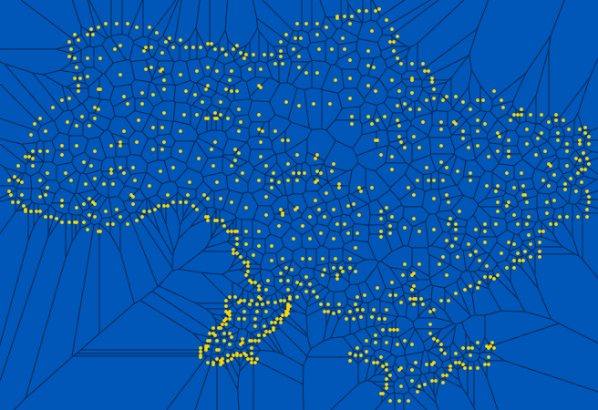

# Delaunator
Fast 2D Delaunay triangulation. A Nim port of [Mapbox/Delaunator](https://github.com/mapbox/delaunator).

> Note: This port of Delaunator is not optimized. That said, give the benchmark a run an see if it measures up. Even better, help optimize the code! ([notes on this port](#notes-on-this-port))

`nimble install delaunator`

[API Reference](https://patternspandemic.github.io/delaunator-nim/) - A work in progress.

See also, [Pixienator](https://github.com/patternspandemic/pixienator), a helper library for visualizing Delaunator using [Pixie](https://github.com/treeform/pixie).



### Features
- Delaunay Triangulation
- Voronoi Regions
- Uses porteded robust-predicates for robustness
- Helpers for navigating various parts of the datastructure (not optimized)
  - Includes clipping of infinite regions, ala d3-delaunay's implementation

### Examples
#### *Construction*
The very basics, import delaunator and construct with a flat seq of coordinates:
```nim
import delaunator

var
  # A flat seq of `float64` coordinates
  coords = @[63.59410858154297, 198.1050262451172, 215.7989349365234, 171.0301208496094, ...]
  # Construct from coordinates
  d = delaunator.fromCoords[float64](coords)

# Triplets of site ids.
echo d.triangles
# @[4, 5, 1, 4, 0, 5, 5, 6, 1, ...]
```
One can construct from a seq of pairwise points as well:
```nim
var
  points = @[[63, 198], [215, 171], [33,  261], [40, 61], ...]
  # Constructs into a seq of `float32` coordinates
  d = delaunator.fromPoints[array[2, int], float32](points)

# Halfedges of triangulation.
echo d.halfedges
# @[5, 8, 11, 14, 17, 0, -1, 9, ...]
```
Construction from more complicated types can be accomplished with `fromCustom`:
```nim
type
  Site = tuple
    label: string
    x, y: int

let
  getSiteX = proc (t: Site): float32 = float32(t.x)
  getSiteY = proc (t: Site): float32 = float32(t.y)

var
  # A custom seq of Sites
  sites: seq[Site] = @[("a", 63, 198), ("b", 215, 171), ("c", 33,  261), ("d", 40, 61), ... ]
  # Construct
  d = delaunator.fromCustom[Site, float32](sites, getSiteX, getSiteY)
```
#### *The Delaunator Object*
...
#### *Helpers*
...

### Performance
I'd post some numbers here, but my kit is so old, you best just run the benchmark yourself. See [tests/bench.nim](https://github.com/patternspandemic/delaunator-nim/blob/main/tests/bench.nim) for a benchmark based off the one in the original implementation.

### Notes on This Port
This port has been implemented with a novice understanding of Nim, with all that entails. Practically speaking, this means the code has room for optimization, may not adhere to nim conventions and styling, and may contain outright puzzling verbosity / actions.

Some of this is on purpose. For instance, keeping code structure and variable naming as close to the original implementation made it easier to perform the port and locate bugs.

I've attempted to support both floating point types for coordinates via generics. This appears to have made the code a bit rough around the edges with casting here and there to appease the compiler.

Furthermore, the way halfedges are used as indices into triangles (and therefor coordinates) is problematic (I think) to access the full range of points beyond the high(int32) without changing halfedges to be int64. More testing will have to be done to determine tradeoffs.

In general, I suspect a number of edge cases have yet to be handled.
